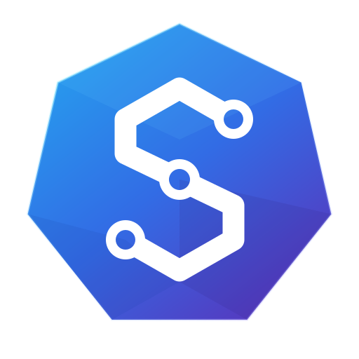

  

# StreamSkope

A desktop workbench for exploring and troubleshooting Kafka.

Inspect messages, investigate consumer lag, and manage cluster resources from
one application.

<picture>
  <source media="(prefers-color-scheme: dark)" srcset="website/docs/assets/messages-dark.png">
  
</picture>

## What you can do

- Browse topics, filter messages, inspect payloads and export records.
- Monitor consumer groups, stream activity and latency.
- Manage topic configuration, Schema Registry and ACLs.
- Test message rules and inspect deployed Redpanda transforms.
- Save connection profiles with TLS and OAuth, with optional SSH or HTTPS
  secret retrieval.

Schema Registry requires a configured service. Deployed transforms require
Redpanda; they are not a standard Kafka capability.

## Get started

[Download for macOS, Windows or Linux](https://github.com/asadarafat/streamskope/releases/latest) ·
[Documentation](https://asadarafat.github.io/streamskope/) ·
[Install StreamSkope](https://asadarafat.github.io/streamskope/start/installation/) ·
[Try it with local Kafka](https://asadarafat.github.io/streamskope/start/quickstart/) ·
[Connect your cluster](https://asadarafat.github.io/streamskope/guide/connections/)

## Documentation

- [Messages and filtering](https://asadarafat.github.io/streamskope/guide/messages/)
- [Consumer lag](https://asadarafat.github.io/streamskope/guide/operations/)
- [Schema Registry](https://asadarafat.github.io/streamskope/guide/schema-registry/)
- [Optional secret retrieval](https://asadarafat.github.io/streamskope/guide/secret-retrieval/)
- [Troubleshooting and profile recovery](https://asadarafat.github.io/streamskope/guide/troubleshooting/)

## Support StreamSkope

If StreamSkope helps your work, you can support its continued development.

## License

[Apache-2.0](LICENSE).
