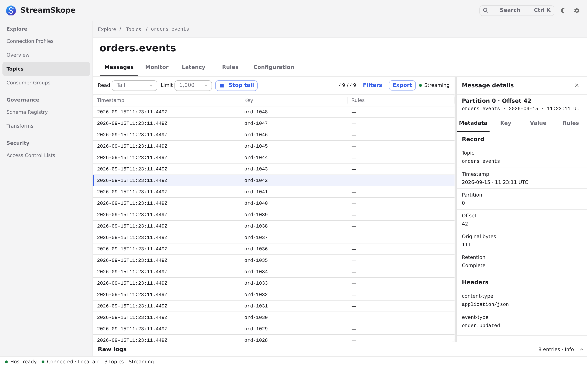

  

# StreamSkope

A desktop workbench for exploring and troubleshooting Kafka.

Inspect messages, investigate consumer lag, and manage cluster resources from
one application.

<picture>
  <source media="(prefers-color-scheme: dark)" srcset="website/docs/assets/messages-dark.png">
  
</picture>

## What you can do

- Browse topics, filter messages, inspect payloads and export records.
- Monitor consumer groups, stream activity and latency.
- Manage topic configuration, Schema Registry and ACLs.
- Test message rules and inspect deployed Redpanda transforms.
- Save connection profiles with TLS and OAuth, with optional SSH or HTTPS
  secret retrieval.

Schema Registry requires a configured service. Deployed transforms require
Redpanda; they are not a standard Kafka capability.

## Get started

[Install StreamSkope](website/docs/start/installation.md) ·
[Try it with local Kafka](website/docs/start/quickstart.md) ·
[Connect your cluster](website/docs/guide/connections.md)

## Documentation

- [Messages and filtering](website/docs/guide/messages.md)
- [Consumer lag](website/docs/guide/operations.md)
- [Schema Registry](website/docs/guide/schema-registry.md)
- [Optional secret retrieval](website/docs/guide/secret-retrieval.md)
- [Troubleshooting and profile recovery](website/docs/guide/troubleshooting.md)

## Support StreamSkope

If StreamSkope helps your work, [buy me a coffee](https://buymeacoffee.com/asadarafat).

## License

[Apache-2.0](LICENSE).
