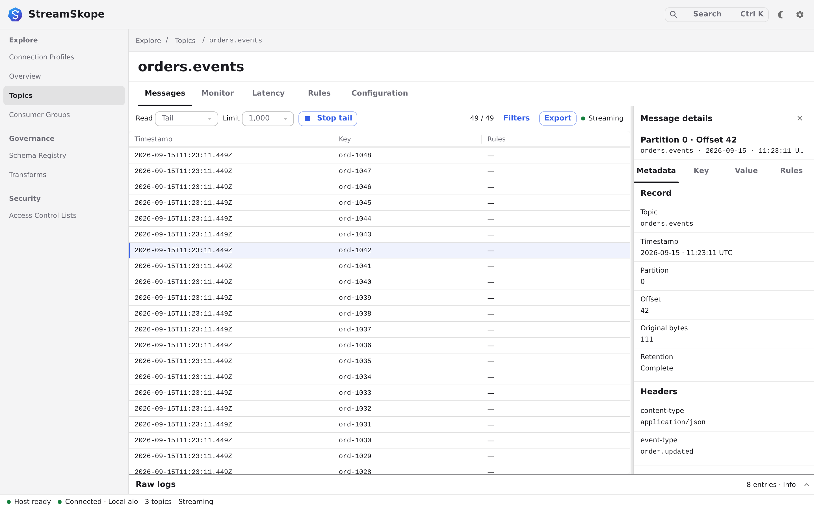

  

# StreamSkope

A desktop workbench for exploring and troubleshooting Kafka.

Inspect messages, investigate consumer lag, and manage cluster resources from
one application.

<picture>
  <source media="(prefers-color-scheme: dark)" srcset="website/docs/assets/messages-dark.png">
  
</picture>

## Download

The published release is **v0.1.0+build.1** (app version **0.1.0**), available for macOS
**ARM64**, Windows **x64** and Linux **x64**. Download it from the
[GitHub release](https://github.com/asadarafat/streamskope/releases/tag/v0.1.0%2Bbuild.1).
Desktop packages are **unsigned prereleases**. Verify the installer against its release's
`SHA256SUMS` and follow the [platform installation instructions](website/docs/start/installation.md).
Kafka is a separate service; the desktop installer does not require Node or Docker.
The [qualification record](website/docs/guide/qualification.md) links the release's
automated checks and identifies workflows that still need recorded evidence.

## What you can do

- Browse topics, read and filter messages, inspect payloads and export filtered JSON.
- Investigate consumer lag, stream activity and producer/consumer probe latency.
- Manage topic configuration, Schema Registry and ACLs.
- Test message rules and inspect deployed Redpanda transforms.
- Save TLS and OAuth connection profiles, with optional SSH or HTTPS secret retrieval.

Kafka authentication supports **OAUTHBEARER or no SASL**. Schema Registry is a
separate service; browsing schemas does not decode Avro/Protobuf message bytes.
Transform operations require Redpanda. Check the [compatibility matrix](website/docs/start/compatibility.md)
for implemented capabilities, tested environments and limitations.

## Read your first message

1. [Install and open StreamSkope](website/docs/start/installation.md) for your platform.
2. [Connect your Kafka](website/docs/guide/connections.md) using reachable brokers,
   trust material and any required OAuth credentials.
3. [Read your first message](website/docs/start/quickstart.md#3-open-a-record) from a known topic.

Use an inspection account with the [required permissions](website/docs/guide/security.md).
Configuration changes, ACL/schema operations and latency probes can write to your services.

## Documentation and help

These repository guides describe this checkout. The
[published documentation](https://asadarafat.github.io/streamskope/) is built from qualified `main`; its version notice identifies the desktop release
it describes. Installer availability is verified before the site is published.

- [Messages and filtering](website/docs/guide/messages.md), [consumer lag](website/docs/guide/operations.md)
  and [Schema Registry](website/docs/guide/schema-registry.md)
- [Security and permissions](website/docs/guide/security.md),
  [backup and recovery](website/docs/guide/recovery.md), and [data and export limits](website/docs/guide/data-handling.md)
- [Troubleshoot a problem](website/docs/guide/troubleshooting.md)
- [Report a defect](https://github.com/asadarafat/streamskope/issues): include the
  exact release tag, OS/architecture, action and redacted error. Exclude credentials,
  tokens, private payloads and complete application-data directories.

## Development

See [CONTRIBUTING.md](CONTRIBUTING.md) for the five project commands, checks and
release process. The [development sandbox](website/docs/start/development.md)
provides disposable local Kafka and requires Node, Docker, Containerlab and Java.

## Fund development

If StreamSkope helps your work, you can support its continued development.

## License

[Apache-2.0](LICENSE).
