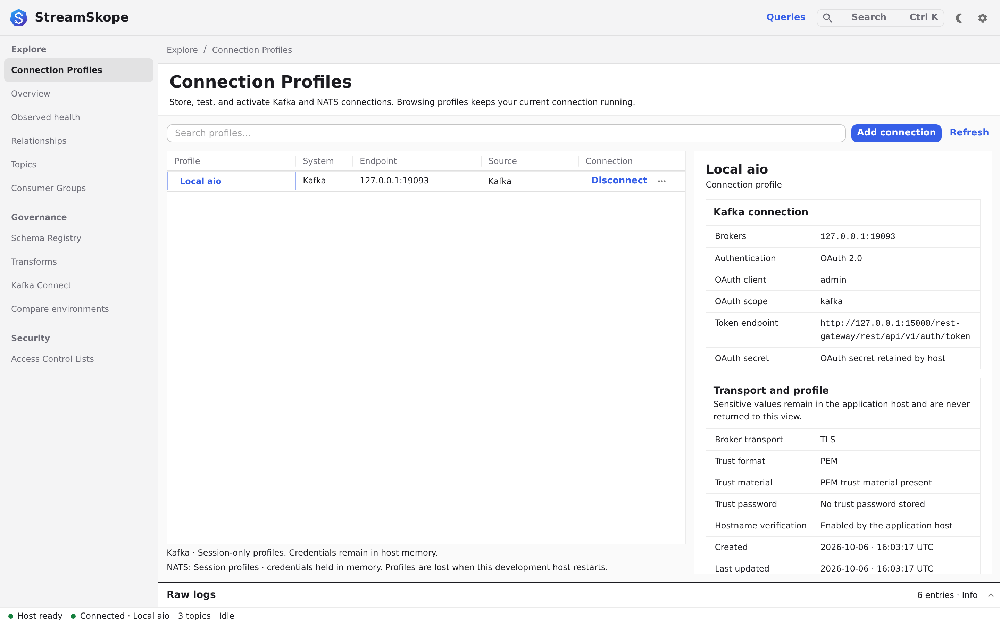

# Connect your Kafka

Save a connection profile, test it, and open your cluster's topics.
A profile keeps the settings for one Kafka connection together.

Trying StreamSkope for the first time? Follow the [desktop quickstart](../start/quickstart.md).
For a disposable broker in a development checkout, use the [development sandbox](../start/development.md).

Check the [compatibility matrix](../start/compatibility.md) before requesting credentials.

## Before you start

Have your bootstrap broker addresses and authentication settings ready. TLS is
the default and requires PEM, JKS or PKCS12 trust material. Explicit plaintext
connections require no broker trust but leave broker metadata, messages and
Kafka OAuth credentials unencrypted. Broker addresses must be reachable from
the machine running the StreamSkope host. Review the [workflow permissions](security.md#kafka-access-and-effects)
with your administrator before requesting access.

The profile's CA bundle also supplies trust for HTTPS OAuth, Schema Registry and
Redpanda Admin requests. Follow [Configure certificate trust](tls-trust.md) when
these services use different issuing CAs; there is no separate CA field per service.

## Configure manually

1. Open **Connection Profiles**, then **Add connection → Existing Kafka cluster**.
2. Enter a **Profile name** you will recognize and the **Bootstrap brokers**.
3. Keep the default **TLS** broker transport and select the matching certificate
   or truststore, or deliberately select **Plaintext (insecure)** for an isolated
   unsecured environment. Plaintext never results from missing trust or a failed
   TLS attempt.
4. If your cluster uses OAuth, enable **Use OAuth OAUTHBEARER** and enter its
   token endpoint, client ID, client secret and scope. OAuth and configured
   Schema Registry or Redpanda Admin endpoints remain available with either
   broker transport; HTTPS endpoints still verify certificates.
5. Click **Test connection**. Wait for the result. If it fails, open **Raw logs**
   and resolve the reported connection, certificate or authentication problem.
6. Click **Save profile**. Find the saved profile and click its connect/play button.
7. Wait for **Connected**, then open **Topics**.

**You should see:** the topics your account can access. Testing checks the supplied
settings; you still need to save and connect to use them.

<figure class="product-shot">
  
  <noscript></noscript>
</figure>

## Read messages from EDA

Install **EDA Capture** through **Preferences → Plugins**, then open
**Add connection → Capture from EDA**. Follow [Capture from EDA](../plugins/eda.md) for
cluster prerequisites, existing Kafka access, temporary captures and recovery.
Installation, updates and removal apply without restarting the desktop.

### Connect to existing Kafka

The [EDA guide](../plugins/eda.md#use-existing-kafka) explains discovery and the separate
Kafka credentials/network access required for an existing destination.

### Start a temporary capture

Review [administrator prerequisites](../plugins/eda.md#administrator-prerequisites), then
follow [Start temporary capture](../plugins/eda.md#start-temporary-capture).

### Stop, remove and recover

Use the [EDA lifecycle table](../plugins/eda.md#stop-update-and-resume) and
[cleanup verification](../plugins/eda.md#administrator-diagnosis-and-cleanup-verification).
A saved profile does not guarantee that its temporary capture still exists.

## Connect through NSP

Install NSP Capture, then use your NSP API URL and credentials to create a tested
Kafka profile. Follow [Connect to NSP Kafka](../plugins/nsp.md) for the workflow,
permissions and cleanup behavior. Check each plugin's [desktop and target requirements](../plugins/versioning.md); the original
v0.1.0+build.1 packages and upcoming API 4 packages have different host requirements.

## Next: inspect a message

[Open a topic and read a record →](messages.md)

If you cannot connect, follow [Fix a connection problem](troubleshooting.md).
For Schema Registry, [configure and check its separate service connection](schema-registry.md).

## Automate repeated setup

Use a [Secret Retrieval Profile](secret-retrieval.md) to retrieve trust material
and suggest OAuth settings, then test and save the connection as above.

## Update or recover

1. Open the saved profile's editor and change the settings you need.
2. Test the edited settings before updating the profile.
3. Reconnect and confirm that the expected topics are available.

Editing non-secret settings retains protected values unless you replace or clear
them. Desktop secrets use the operating-system credential service; browser
development profiles are session-only.

Before replacing or downgrading the app, follow [Upgrade, back up and recover](recovery.md).
That page owns storage locations, migration-specific snapshots and restoration.
See [Data and exports](data-handling.md) for files outside the protected profile store.
