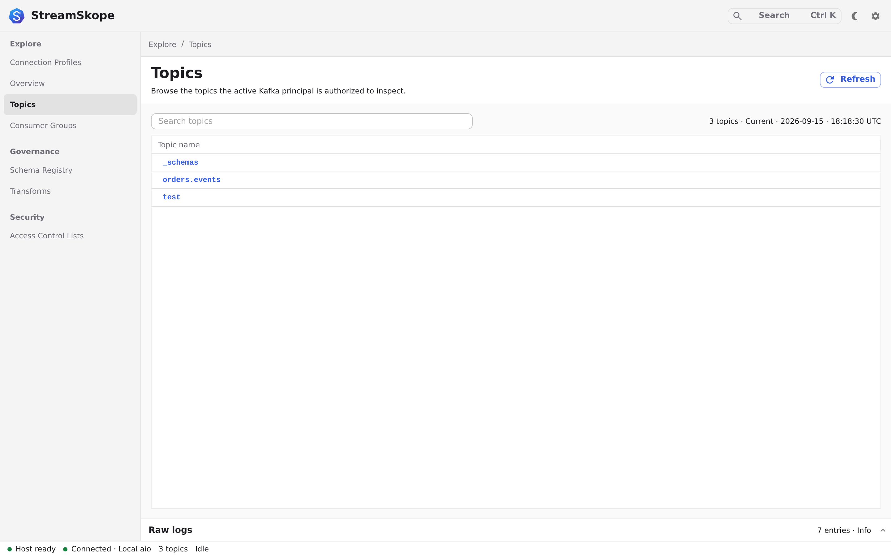

# Find and inspect a message

Open a topic, narrow the records on screen, and read a message with its key,
headers and offset. Start with a [connected profile](connections.md).

## Open a topic

1. Open **Topics** in the left navigation.
2. Select the topic you want to inspect. In the [development sandbox](../start/development.md), use `test`.
3. Wait for the **Messages** table to load.

**You should see:** records from the selected topic, or a stream waiting for data.

<figure class="product-shot">
  
  <noscript></noscript>
</figure>

## Read and filter

1. If a read is running, click **Stop tail**, **Pause read** or **Pause search** to enable its settings.
2. Use **Read** to choose **Tail** for ongoing traffic, or **Newest N**, **First N** or **Time window** for a bounded read. Set **Limit** to the number of records you need.
3. Click **Start tail** or **Load messages**, depending on the chosen mode.
4. Once the records you need are present, click **Stop tail** for a stable view
   or wait for the snapshot to complete.
5. Copy a key from a visible record, then open **Filters**.
6. Paste that key into **Key contains** and select a matching row.
7. Clear the filter to restore the other loaded records.

**You should see:** only matching records in the current view. Filters work on
records available to the workbench; they do not search the entire cluster.
If nothing matches, clear the filter and check the topic and read mode. Filters
use the shared record interpretation and masking policy. An unavailable decoded
field is reported separately from a field that did not match; inspect **Decoded**
and the [encoding preferences](structured-events.md) when records cannot be evaluated.

## Choose a read mode

| Read mode   | What it requests                                            | Completion                                                 |
| ----------- | ----------------------------------------------------------- | ---------------------------------------------------------- |
| Tail        | A recent starting window, then incoming records             | Runs until stopped; the display remains bounded            |
| Newest N    | Recent offsets from each partition, capped by Limit overall | Ends at the captured partition ends or the record limit    |
| First N     | Earliest retained offsets in each partition                 | Ends at the captured bounds or the record limit            |
| Time window | Last 2 minutes, or your explicit custom start/end interval  | Ends at the time-derived offset bounds or the record limit |

Limit is an overall fetch cap for bounded reads, not a promise of that many records
from each partition. Newest N is not a globally sorted latest-N query: partition
arrival order and the cap affect which records you receive. First N cannot recover
records already removed by retention or compaction. The active time-window bounds
are displayed in UTC.

For a past incident, select **Time window → Custom interval**. Enter an inclusive
**Start time** and an exclusive **End time**, using ISO 8601 with seconds and a
time zone: `2026-07-24T16:03:00+02:00` and `2026-07-24T14:03:00Z` represent the
same instant. Check **Requested interval in UTC** before loading. Missing time
zones, impossible dates, and end times at or before the start disable loading.
The chosen settings stay available after completion or cancellation so you can
adjust and repeat the read. **Last 2 minutes** continues to resolve its bounds
when you click **Load messages**.

Kafka resolves time-window boundaries to offsets per partition. This is not a
payload-time search or a guarantee of completeness when timestamps are out of
order. **Timestamp contains** matches record timestamp text, in the loaded sample
or a bounded broker search; it does not establish the time-window offset boundaries.

### Example: inspect a past incident and save the result

Suppose an error happened at 14:03 UTC on `orders.events`:

1. Select that topic, stop any active read, select **Time window**, and set **Limit**
   to `1000`. Choose **Custom interval**, enter that date's start and end times
   around the incident with `Z` for UTC, and click **Load messages**.
2. Note the UTC range shown by **Active fetch request** and wait for completion,
   or use **Pause read** to stop the read. History removed from Kafka cannot be recovered.
3. Open **Filters**, set **Key contains** to a known affected key, and inspect
   matching records' partition, offset and timestamp.
4. Clear the filter if you need the rest of the loaded sample. Reaching the limit,
   an empty match or a timeout does not prove that the interval has been fully examined.
5. Use **Export** as described below and retain the UTC range separately alongside
   the export; the file is a bounded sample, not a complete incident archive.

## Inspect a record

1. Select a row to open **Message details**.
2. Choose **Value** to inspect the interpreted value. For JSON, compare **Formatted JSON** and **Raw**; both use the same projection.
3. Choose **Key** to inspect the record key.
4. Choose **Metadata** to read its partition, offset, timestamp and headers.

Choose **Original** for the retained key, value and ordered headers as Base64.
**Copy original record** preserves binary bytes, repeated headers and the difference
between null and empty values. The tab explains when originals are unavailable.
The **Raw** value view shows the unformatted interpretation, not necessarily the
wire bytes. **Decoded** identifies the encoding and writer schema or explains a
decoding error. **Copy** uses the same protected value as the table and filters.
See [saved encoding preferences and detection](structured-events.md) and
[record limits and export format](data-handling.md#understand-an-export).

**You should have:** the payload and the topic, partition and offset needed to
find its position again. An offset belongs to one partition; it does not order
records across the whole topic.

<figure class="product-shot">
  
  <noscript></noscript>
</figure>

## Save and reopen an investigation

### Use the keyboard

Open **Search and commands** with **Ctrl+K** (Linux/Windows) or **Cmd+K** (macOS).
Type part of a profile name, broker address, topic or command, then use **↑/↓**
and **Enter** to choose. **Home/End** moves to the first/last result when a result
has focus; **Escape** closes the palette and returns focus to its opener.

Selecting a profile does not connect. Run **Connect profile …** separately.
Topic results are labelled **Open and read topic …** and start the current read
mode. The palette also offers **Load messages …** or **Start tail …**,
**Search broker …**, **Stop current read**, and **Saved queries**. Unavailable
actions remain disabled until their connection, topic, filter or read prerequisites
are satisfied. The shortcut leaves an already-open editor or query dialog in charge
of keyboard focus.

Use **Tab/Shift+Tab** to reach read controls and filters. In the message grid,
arrow keys move through cells and **Shift+Space** selects the row for inspection.
Tab to **Close inspector** and press **Enter** to return to the messages. Query
save/delete operations return focus to **Query name**, so the dialog remains
usable when the action that initiated the write becomes disabled.

### Keep query settings

1. Choose a topic, read mode, limit and filters. Use a custom time interval for
   a repeatable incident window. Saving **Last 2 minutes** captures absolute times
   at the moment you save; reopening does not move that interval forward.
2. Open **Queries** in the header, enter **Query name**, optionally choose a
   **Local connection profile**, and click **Save current as new**.
3. Later, choose the entry in **Saved query** and click **Open query**. Opening
   restores the controls and clears previous results. It never connects or reads
   automatically. Stop a running read before opening another query.
4. Connect the chosen profile if needed, check the topic and interval, and click
   **Load messages**, **Start tail** or **Search broker** explicitly.
5. To change an entry, open it, adjust the controls, return to **Queries**, select
   it and use **Replace selected**. **Delete selected** asks for confirmation and
   removes only the saved configuration.

Queries retain topic, bounds, filters and limits, plus an optional local profile
reference. They contain no broker credentials or message records. Filters can
still contain sensitive text you enter; treat saved query files accordingly.
The dynamic **Rule matches only** switch cannot be saved; use a JSON expression
for a repeatable independent filter. A deleted profile must be replaced or its
reference cleared before opening. Missing topics still require operator review.

The desktop stores up to 100 queries in its application data at
`queries/kafka-queries.json`, using atomic private writes. Back up this file with
the [application data](recovery.md). Browser development keeps its query library
only until the development host restarts. An unreadable, oversized or unsupported
library is preserved and reported as unavailable; restore a valid backup before
retrying. StreamSkope does not silently replace that file with an empty library.

### Share query settings

1. Open **Queries** and select a saved query, or leave the selection empty to use
   the current topic settings. Review your filter text before sharing it.
2. Choose **Export query JSON** for a configuration file, or **Copy query link**.
3. The recipient opens **Queries → Import and share**, chooses **Import query file**,
   or pastes the link into **Query JSON or link** and clicks **Review import**.
4. Review the displayed topic, absolute time bounds, filters and limits. Choose a
   local connection if appropriate, then **Open imported query**. Connect and run
   separately. Save the restored settings in the library to keep them.

Browser links open the development application at its original address and show
the review dialog; that development host must be reachable. The fragment is removed
from the visible address when loaded. Desktop links use `streamskope://app/#query=…`
as a portable string to paste into the dialog; this version does not register an
operating-system link handler to launch the app. JSON files work in either host.

The format is a version 1 query document, limited to 32 KiB. Imports reject
unknown fields, future schema versions, credentials, local profile identifiers,
message records and unsupported expressions. Invalid imports leave the current
investigation unchanged. Opening a valid import restores controls without
connecting, consuming, saving it to the library or changing Kafka resources.

Query links encode the document in their fragment; encoding is **not encryption**.
Topic names and filter text can disclose incident details or sensitive literals
you entered. Share them only with intended recipients. Importing a pasted URL
decodes its fragment locally and does not visit that URL.

## Export the records you need

### Save the current page

1. Stop an active tail or wait for the bounded read to finish so the sample is stable.
2. Set the filters you want. The shown/retained count indicates how much of the
   retained sample is visible; selecting a row does not limit the export to that row.
3. Click **Export → Current page JSON**. Desktop opens a save dialog; the browser
   starts a download. This exports only the filtered records still retained in the grid.
4. Check the JSON's topic, filters, retained/exported counts, stale-state marker and
   truncation fields before using it as evidence.

Older records may have left the window. **Monitor** distinguishes ordinary history
eviction from overload drops. Narrow the sample if the page export exceeds its byte limit.

### Read and export a larger range

1. Connect to Kafka and open the topic's **Messages** tab.
2. Set the message filters, then choose **Export → Read range…**. Turn off
   **Rule matches only**: live-rule annotations cannot be reused for this new read.
   Key, value, timestamp, offset, partition and JSON expression filters are supported.
3. Choose **From beginning** (the earliest retained offsets) or **Time interval**,
   select **JSONL** or **CSV**, and set the maximum exported record count. A tail or
   newest-record read is never silently converted into an export range.
4. Click **Start export**. The host captures the range's end offsets, filters,
   encoding preferences and masking settings, then writes the export without
   filling the grid. You can browse another topic; the **Range export** status
   retains the original topic and progress when you return to Messages.
5. Wait for completion, or choose **Cancel export** to stop and keep the successfully
   written prefix. **Partial range export** means the range was not fully covered.
   Limits, cancellation, filter evaluation failures and Kafka retention can affect coverage.
6. Choose **Download export** and **Download receipt**. Inspect the receipt's outcome,
   counts, partition offsets and SHA-256 hash before relying on the file.

One export is retained at a time. Starting another requires confirmation to replace
its prepared download. **Discard export** removes that temporary host copy. Ready
files expire after 15 minutes and are revoked on disconnect, browser lock or host
shutdown. Downloaded copies remain on your device. Desktop reports a confirmed
Save or cancellation; browser **download started** means you must check the browser's
download list for completion.

A failed start acknowledgement offers **Retry same export request**, preserving the
request identity. If cleanup cannot be confirmed, refresh status and follow the recovery message.
Retry cleanup when offered; an unresolved broker close may require disconnect or
host restart. Starting another export cannot bypass the unresolved operation.

Review [Data, exports and limits](data-handling.md) for plaintext contents, bounded
coverage, per-record decoding errors, and the differences between page JSON, range
JSONL and CSV. A range export is not a complete Kafka backup.

## Count and inspect a range

**Analyze range…** counts matching records directly from Kafka. It does not count
only the rows left in the message grid.

1. Open the topic's **Messages** tab and set any filters. Turn off **Rule matches
   only**, which depends on live annotations rather than the new range read.
2. Choose **Analyze range… → Setup**. Select **From beginning** or **Time interval**
   and a maximum matching-record count. Leaving the field list empty performs a
   count only; Tail and Newest settings do not silently become analysis bounds.
3. Optionally choose **Add field**, select Value or Key, and enter a scalar path.
   Use `$` for the whole field, `$.status` for a property, or `$.items[0].name` for an
   array element. Give the column a label if useful. Wildcards, recursive paths,
   predicates, objects and arrays are not scalar projections.
4. Optionally choose one selected field under **Count by**. Number `1`, string
   `"1"`, JSON null, null key, tombstone and missing path remain distinct groups.
5. Click **Start analysis**, then read **Results**. Closing the dialog lets the
   host continue; use **View analysis** from its compact status row to return.
   Changing topics or draft controls does not relabel the captured operation.
6. Choose **Cancel analysis** to stop and retain the confirmed count prefix.
   Wait for its final state. An unresolved reader cleanup keeps its operation
   visible; follow the recovery message before starting again.

Read each part independently:

- **Count for captured range complete** means the captured offset ranges were
  scanned and no filter evaluations were unknown. **Partial count** names the
  limit or cancellation that stopped it. Newly arriving records are excluded.
- **Count by** gives its grouped denominator and excluded records. A complete
  match count can still have incomplete grouping when protected or unavailable
  values are excluded. Masked values are never combined into a fabricated group.
- **Projection preview** contains at most 200 rows and 256 KiB. Counting continues
  after the preview fills. Its rows follow the captured read order; they are not
  a representative sample or a globally timestamp-sorted history.

Selected fields use the same saved encodings and masking as message inspection.
A missing path, null key, Kafka tombstone and decoded JSON null have distinct
labels. Unsupported or unavailable fields do not invalidate a known total count.
A literal unmasked string `"[MASKED]"` remains a string; only protection evidence
marks a cell as masked. Inspect **Field availability across all counted records**
for whole-range field counts, not just the bounded preview.

One analysis result is retained per host session. Starting another requires
confirmation to replace it; it does not replace a prepared export file. Disconnect,
lock or host shutdown clears its projected and grouped data. Saved analysis jobs and report downloads are unavailable. See [analysis bounds](data-handling.md#analysis-limits)
for group, work and memory limits.

## Next: check a consumer

[Check consumer lag and offsets →](operations.md)

## Rules and configuration

For a repeatable check against a real record:

1. Copy the record's JSON value, then open **Rules**.
2. Click **Create rule**, or select a saved rule. Review its **JSONPath expression**, **Topic filter**
   and severity; use **Syntax** for the supported expression forms.
3. Open **Test**, paste the copied value into **Sample JSON**, and choose
   **Evaluate selected rule**.
4. Read the result and any stale-result notice before relying on it.

The test runs locally in the host. The topic filter controls where a saved rule
applies; opening a topic does not limit every rule to that topic.

To change broker settings, follow [Change topic configuration](topic-configuration.md)
for preparation, dry-run validation, confirmation and recovery. To measure a
producer/consumer round trip, use [Run a latency probe](latency.md); it writes
records to Kafka.

## Search beyond the loaded sample

Message filters immediately narrow the records already retained in the window.
An empty filtered table does not establish that Kafka has no matches.

1. Open **Filters** and enter key, value, timestamp, offset or partition criteria.
2. Choose **First N**, **Newest N** or **Time window**. Broker search is finite;
   stop a tail before starting it. Turn off **Rule matches only**, which depends
   on the local rule inventory.
3. Select **Search broker**. The record limit caps returned matches, independently
   of the scan budget: each pass reads at most 10,000 records, 32 MiB of record content
   or 30 seconds. The Kafka fetch budget can end a pass earlier. **Pause search**
   closes the consumer and confirms a stopping point before offering continuation.
4. Check **Read coverage** and expand **Partition coverage**. Requested offsets
   are half-open; reached offsets describe actual traversal. A result limit,
   scan/byte/time limit, exhausted fetch budget, failure or cancellation means a
   partial read. Large fields that could not be searched are counted separately.
5. When available, choose **Continue search** to read the remaining captured ranges.
   **Continue read** does the same for a finite read without broker filters.
   Export any records you want to keep first: continuing replaces the displayed
   result page. **Pass** and **Total** report cumulative progress across passes;
   the coverage summary reports the current pass.

Search uses the current filter values at the moment it starts. Subsequent edits
only filter the loaded result sample; run the search again to change its broker
criteria. Text matching is case-insensitive substring matching. Values omitted
because they exceed the payload limit cannot establish a negative match.

### Continue a finite read

A continuation keeps the original partition ranges, query, encoding choices and
masking policy. New records arriving after the first pass are outside those ranges.
Partition coverage retains the original start and end offsets while the reached
offset advances. Records that could not be evaluated remain in the cumulative
unavailable count, even after all captured offsets have been reached.

Only the latest continuation is available, and it can be used once within 30
minutes of its creation. Starting another read, disconnecting, changing record
settings or restarting the host invalidates it. Saved queries keep search settings;
they do not save a continuation. To change criteria or include new arrivals, start
a new search.

**Pause search** or **Pause read** must finish closing the consumer before a
continuation becomes available. A failed or zero-progress read, lost delivery or
an unresolved stop does not establish a safe continuation. If retention has
removed unread offsets, the topic has been replaced or its partition inventory
has changed, continuation fails with instructions to start a new read. It does
not silently skip the missing range. After 10,000 passes, start a new read.

This is a temporary, host-owned checkpoint. It does not survive host restart,
accumulate every result page in memory or provide a complete topic export.

First N searches forward from retained low offsets. Newest N searches a bounded
recent candidate range, up to 10,000 offsets per partition, with a topic-wide scan
budget. A time window uses Kafka timestamp lookups and tests each record against
the selected interval. Reaching those offset ranges does not prove that deleted
history is available or that records with out-of-order timestamps were included.

## Filter JSON values

In **Filters → JSON expression**, use the same bounded expression language as
**Rules**, for example `$.status == "failed" && $.attempts > 2`. The expression
applies to the loaded sample and is included when you select **Search broker**.
An invalid expression disables broker search; clearing it restores field-only
filtering. A query contains the expression itself, independent of any saved rule
name, rule severity or cooldown.

| Operation                       | Meaning                                                                              |
| ------------------------------- | ------------------------------------------------------------------------------------ |
| `$.a == null`                   | Matches an explicit JSON null; a missing property does not match.                    |
| `$.a exists`                    | Requires a present value other than null; false and zero exist.                      |
| `$.a > 2`                       | Requires a finite JSON number. Numeric strings, null and booleans are not converted. |
| `$.items[*].status == "failed"` | Matches when an array item has that exact value.                                     |
| `&&` / `\|\|`                   | AND / OR, with AND taking precedence; use parentheses to group.                      |
| `$.name matches /^edge-/i`      | Restricted regex; repetition, lookarounds and backreferences are rejected.           |

Expressions allow 4,096 characters, 64 conditions, 64 path segments and 16 grouping
levels. Each evaluation has 250,000 work units for traversal and comparison;
loaded-sample filtering shares a further 500,000-unit budget across the selection.
The live/query JSON limit is 256 KiB, 25,000 structural nodes and depth 64. Rule
preview accepts up to 1 MiB and 100,000 nodes but uses the same expression semantics
and per-evaluation work limit.

Malformed, missing, truncated, oversized or over-budget JSON is counted as
**could not be evaluated**, not as a confirmed negative match. Read the partial
result notice before drawing conclusions. Live rules report evaluation failures;
rule preview reports a bounded error. These expressions do not execute JavaScript
or SQL.

## Produce a message

In a topic, choose **Produce message**. Select the partition, enter a key and value,
and optionally add an ordered JSON array of headers. Repeated header names are
preserved. **Null key** differs from an empty key; **Tombstone** writes a null value.
Use the Base64 option for binary key/value bytes and header values. Header names in
the form use UTF-8. Each attempt is limited to one record and 64 KiB including
headers; this is an operational composer, not a bulk importer.

Choose **Review message** and check the connection, topic, partition and complete
Base64 representation before **Confirm produce**. The host binds the review to
that connection and expires it after two minutes. Kafka must already have the
selected topic and partition. Read-only mode blocks confirmation.

An **Acknowledged** result includes the Kafka partition and offset. StreamSkope
attempts to read back the exact key, value and ordered headers without committing
consumer offsets. A failed read-back does not mean the write failed. An **Outcome
unknown** result means Kafka may have accepted the record: inspect the destination
before making a new attempt. The app never automatically resends a record. If the
host response is lost, **Check attempt result** uses the same plan without sending
again. Attempt results are session-local and bounded; after restart, inspect Kafka.

[Trace a correlation ID across topics →](structured-events.md#trace-a-correlation-id-across-topics)

For reviewed recovery, see [copy or replay records](record-replay.md) and
[preview consumer offset resets](offset-recovery.md).
