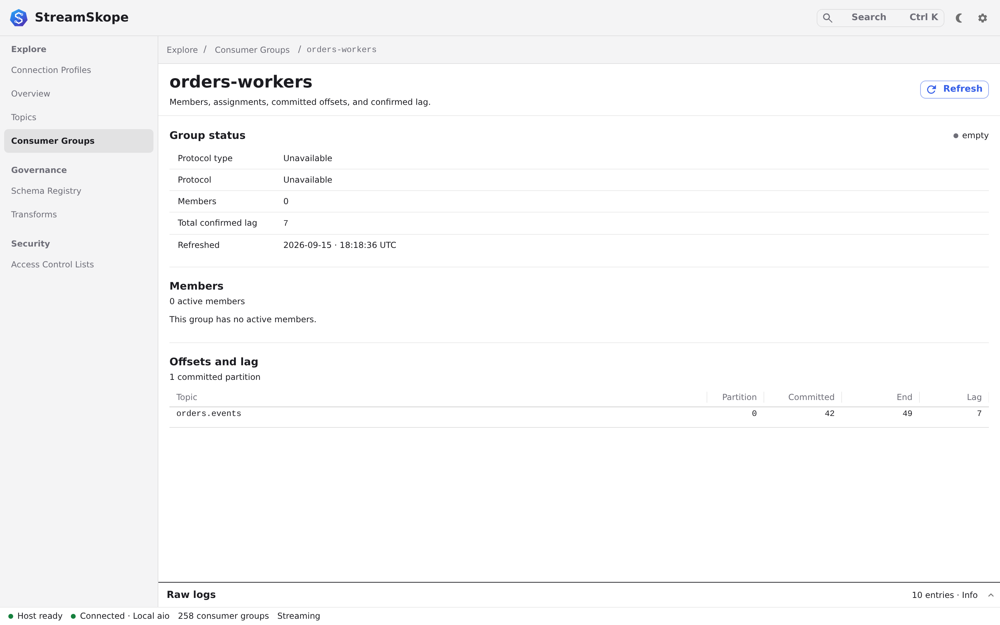

# Check consumer lag

Find a consumer group and compare where it has committed with the end of each
partition. Start with a [connected profile](connections.md) and a group your
account can describe.

## Consumer groups

1. Open **Consumer Groups** in the left navigation.
2. Search for the group you want to inspect and select it.
3. Check its state and refresh time.
4. Read the offsets table: compare the committed offset, end offset and confirmed
   lag for each topic partition.
5. Refresh the group and compare the new values when you need another sample.

**You should see:** the group's reported offsets and any available members and
assignments. A group can have committed offsets without active members.
Lag is the **offset distance** `max(end offset - committed offset, 0)` for each
partition when both offsets are available. It is not an exact remaining-record
count: offset gaps, compaction and transactional records can make those differ.
The committed offset normally identifies where the group resumes, and the end
offset is a boundary, not the offset of a last displayed record.

An unavailable or negative offset produces an unknown lag, not zero. Zero means
no positive offset distance was reported; it does not prove the application has
finished processing. Membership, commits and end offsets are sampled through
separate requests and can change between reads. Lag does not measure processing time.

<figure class="product-shot">
  
  <noscript></noscript>
</figure>

An idle **Empty** group may retain offsets. A deleted group disappears from the
inventory; loading a stale selection can return **Dead** with no offsets or a
not-found response. Neither result establishes zero lag. Permission failures
remain errors; StreamSkope does not invent member or offset data.

If no groups appear, check that a consumer has created a group in your cluster
and that your account has permission to describe it.

## Stream monitor

If messages stop updating or the display falls behind:

1. Return to the topic and open **Monitor**.
2. Check the stream state and freshness before interpreting counters.
3. Inspect delivery, host queues and renderer retention to locate the backlog.
4. Compare history evictions with display-drop counters.

**You should know:** whether the view is receiving data, waiting, stopped or
reporting degraded delivery. Normal history eviction and overload drops are
separate conditions.

## Raw logs

1. Expand **Raw logs** at the bottom of the workbench.
2. Filter by the operation's text or severity.
3. Read the outcome and correlation ID. Scroll upward to pause following.
4. Choose **Resume live** to follow new entries again.
5. Copy or download the relevant entries if you need to share evidence.

Review logs before sharing, even though secrets are redacted. Use
[troubleshooting](troubleshooting.md) to work through a failed operation.

## Latency

Follow [Run a latency probe](latency.md) for an explicit producer/consumer timing
measurement. It writes records to the selected topic. It does not measure this
consumer group's processing latency. The linked runbook covers confirmation,
partial results, stopping and recovery.

## Next: inspect a schema

[Read a Schema Registry version →](schema-registry.md)
